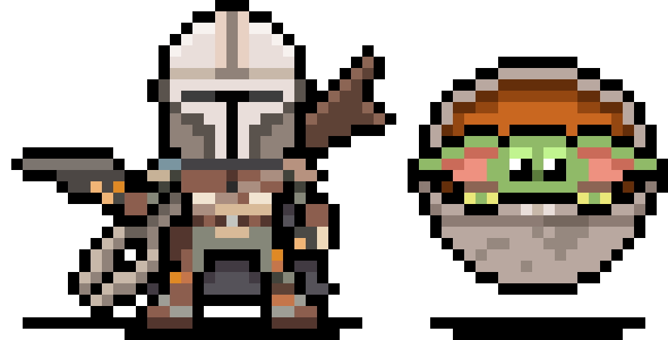

# Matheus Abrahão Martins Alvares <animated-image data-catalyst="" style="width: 30px;"></animated-image>

**`Desenvolvedor/Universitário/Empreendedor`**

Sou desenvolvedor FrontEnd, Universitário em Engenharia de Computação e Empreendedor no mundo digital. Todos os meus
projetos foram desenvolvidos com o propósito de aprender e contribuir para minha carreira como Dev.

---

### Linguagens e Ferramentas 🧰

 

#

### Stats 📊

<!--  -->

#

   

      <h3>👨‍💻 Minha Jornada na Programação</h3>
   

   Desde jovem, sempre fui apaixonado por tecnologia e jogos de computador. Quando eu tinha 14 anos, tive a oportunidade
   de conhecer esse "mundo", foi justamente quando comecei a programar. Meu primeiro contato com uma linha de código foi
   quando tive a ideia de alterar arquivos dentro de um jogo de PC utilizando a linguagem C++, porém foi aí que percebi
   que BackEnd não era minha área, e sim o FrontEnd mais especificamente para Web.
   Mas eu não me contentava apenas com software, aos 15 anos, decidi montar meu próprio PC Gamer. Foi um desafio
   incrível, que me permitiu aprender ainda mais sobre tecnologia e como os componentes de hardware funcionam juntos.
   Depois de um tempo eu já estava montando e fazendo reparos nos computadores de meus amigos/conhecidos.
   Com o passar dos anos, meus conhecimentos e habilidades em programação evoluíram, e eu já tive a oportunidade de
   realizar projetos freelancer de website para empresas pertencentes à conhecidos/amigos. Cada projeto era uma nova
   oportunidade para aprender e aprimorar minhas habilidades, e eu me orgulho de ter contribuído para o sucesso de cada
   uma dessas empresas.
   Hoje, continuo a evoluir como programador e estou sempre procurando por novos desafios e oportunidades de
   aprendizado. Acredito que a paixão pela tecnologia e a determinação de sempre melhorar é a chave para o sucesso nesta
   indústria em constante evolução.